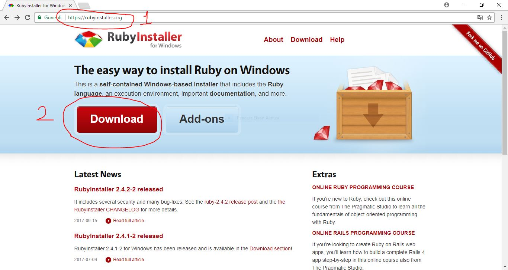
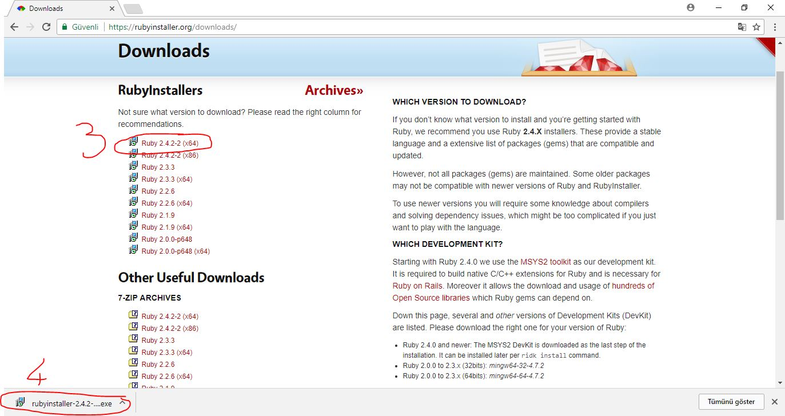
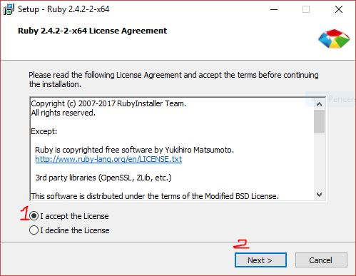
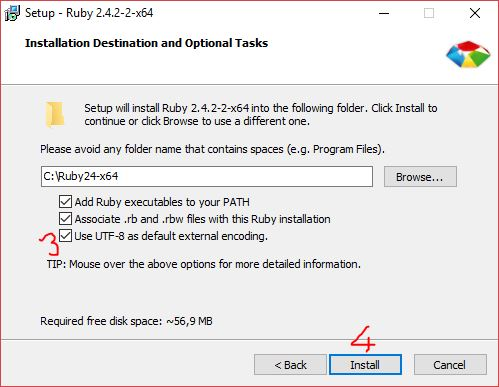
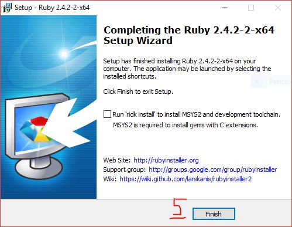

# Ruby Dili Hakkında

Ruby dili, 1990'lı yıllarda `Yukihiro Matsumoto` (veya kısaca __*Matz*__) tarafından geliştirilmeye başlanmıştır.
Ruby'nin ilk stabil sürümü 1995 yılında sunulmuştur.

> [Ruby](http://blog.nicksieger.com/articles/2006/10/20/rubyconf-history-of-ruby/) ismi, 24 Şubat 1993 tarihinde
> Matsumoto ve Keiju Ishitsuka arasındaki çevrimiçi [sohbet otumunda](http://blade.nagaokaut.ac.jp/cgi-bin/scat.rb/ruby/ruby-talk/88819)
> ,dil için herhangi bir kod yazılmadan önce ortaya çıktı.

Matz, Ruby dilini geliştirirken __Perl, Smalltalk, Eiffel, Ada, and Lisp__ dillerinden [esinlenmiştir](https://www.ruby-lang.org/tr/about/).

Ruby dili nesneye yönelik, dinamik, reflektif bir programlama dilidir. Günümüzde en çok web tarafında kullanılır.

# Windows için Ruby Kurulumu

## Ruby'i indirmek

1. [https://rubyinstaller.org](https://rubyinstaller.org) adresine gidilir.

2. Büyük Kırmızı download butonuna basılır.

3. Gelen ruby installer arasından en yenisi, kullanılan bilgisayarın mimarisine göre seçilir. Ve dosya indirilmeye başlar.
> Eğer bilgisayarınız 64 bitse(x64), 32 bitse(x86) seçilir.

4. Dosya indirildikten sonra İndirilenler (`"Downloads"`) dizininin altından çalıştırılabileceği gibi tarayıcınızdan 
tıklayarak da çalıştırabilirsiniz.

## Ruby Kurmak

> Setup tıklandıktan sonra kurulum programı çalışmaya başlar.

1-2. Lisans okunup kabul edildikten sonra `Next`'e basılır.
 

3-4. Seçeneklerin hepsi işaretlenir ve `Install`'e tıklanır.

5. Eğer `Run 'ridk install...` kutusu seçiliyse kapatılır ve `Finish`'e basılır.

## Ruby'i Visual Studio Code'da Test Etmek

Masaüstü'ne bir text belgesi oluşturup `ilk_program.rb` şeklinde adını değiştiriyoruz.

Daha sonra sağtık yapıp bu dosyayı [Visual Studio Code](./001_Visual_Studio_Kurulumu.md) ile açarak içine şunları yazıyoruz:

~~~ruby
puts "Merhaba Dünya!"
~~~

Daha sonra `ctrl + shift + é` ye basarak powershell'in açılmasını sağlıyoruz. Alttan bir panel açılacaktır.
Orda eğer seçili değilse `terminal`'i seçiyoruz.

> Powershell, Windows için geliştirilmiş, arayüz (_pencere_) olmadan bilgisayara iş yaptırmamızı sağlayan bir araçtır. 
> Bu ders süresince bizim için önemli olan verilen komutları çalıştırıyor olmasıdır.

> Not: Programlamaya yeni başlayan biriyseniz başlarda yazdığınız programda arayüz arayacaksınızdır. 
> Bizim kullanacağımız arayüz (hiç olmazsa şimdilik) siyah bir panel olacak. Programımızın çıktısını burada göreceğiz.

~~~bash
cd Desktop
~~~

yazarak komut çalıştıracağımız alanı Masaüstü olarak değiştiriyoruz.
> __``cd``__ komutu şimdilik önemsiz olup sadece işimize yaramasına odaklanmamız gerekmektedir.

daha sonra 

~~~
ruby ilk_program.rb
~~~
yazarak programımızı çalıştırıyoruz.Program çıktısı şu şekilde görülecektir.

~~~
Merhaba Dünya!
~~~

Bu şekilde sonuç aldıysanız, ruby
bilgisayarınıza eksiksiz olarak kurulmuştur.

-----

Bu doküman Taha Yasir Kıroğlu ( GitHub: [@TahaYasirKiroglu](https://github.com/TahaYasirKiroglu) ) tarafından oluşturulmuştur.
