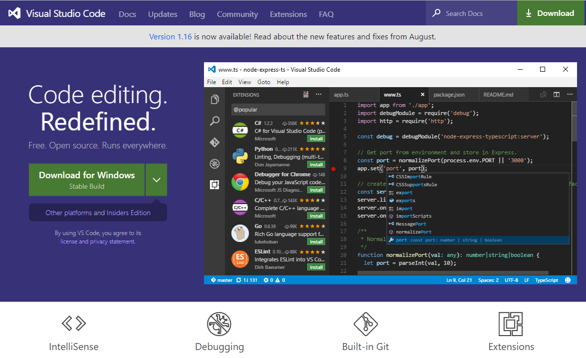
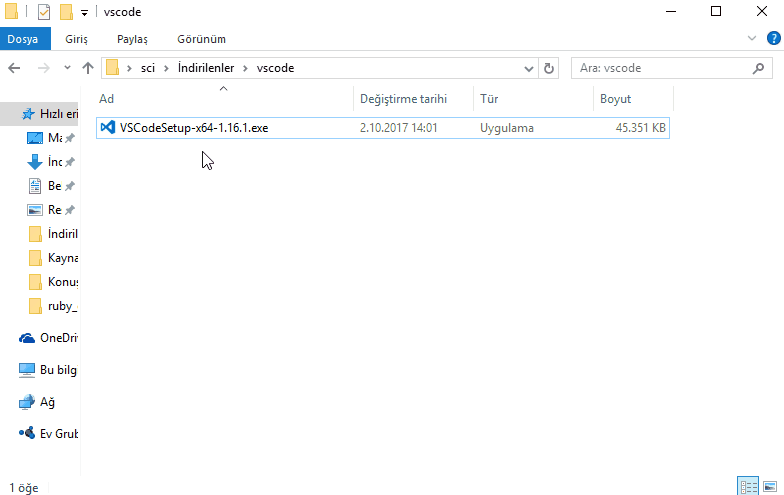

# Kodlama Ortamı ve Visual Studio Code

**Her iş için doğru bir araç vardır!**

Visual Studio Code : Ücretsiz, açık kaynak , heryerde çalışıyor!

## Metin Düzenleyici Nedir?

Metin düzenleyici, bir metin oluşturmanıza ve düzenlemenize yarayan araçtır.
Bu araçla oluşturduğunuz metin saf haliyle kaydedilir, ekranda görünenlerin
aynısı dosya içeriği olarak kaydedilir.

Kodlama için kullanılması gereken araçlar olan metin düzenleyiciler çok farklı
ve gelişmiş özelliklere de sahip olabilirler.
### IDE Nedir?

IDE, programlamaya yeni giriş yapanların uzak durması gereken bir araçtır.

Integrated Development Environment yani Tümleşik(Entegre, gömülü) Geliştirme
Ortamı'nın ilk harflerinin kısaltmasından ismini alan IDE, özellikle
ileri düzey geliştiriciler için büyük kolaylıklar sağlayan araçlardır.

Bir dilin (neredeyse) tüm özelliklerine hakim olan IDE lerde üst düzey
otomatik tamamlamalar, programların derlenmesi ve çalıştırılması (şimdilik
bu terimler bir kenarda dursun), hata ayıklama işlemi ve daha bir çok işlemi
tek bir ana program altında toplanır.

Programlamaya yeni giriş yapan kişiler IDE yi yoğun olarak kullanmaları halinde
dilin temel kalıplarını IDE kendiliğinden tamamlayacağı için bazı kısımları
çok hızlı geçeceklerinden el alışkanlığı edinememe sıkıntısı çekebilirler.
Bu yüzden yeni programcılara Metin Düzenleyiciler üzerinden çalışmalarını
öneririz.

## Kelime İşlemci Nedir?

Kelime İşlemci yada Kelime İşleme Programı metinsel belgeleri düzenlemek,
biçim vermek ve çıktı almak için kullandığımız "Ofis programları" olarak da
nitelendirilen, yazdırılabilir metin düzenleme programlarıdır. Bu programların
genel amacı çıktı alınacak bir evrak yada dosya hazırlamaktır. En bilinen
örnekleri "Microsoft Office Word" ve "Libre Office Writer" olarak
sıralanabilir.

Bu tarz araçlar kod yazmaya uygun **değildir** ve bu araçlarla yazılıp
kaydedilen kodlar çok büyük ihtimalle **çalışmayacaktır**.

### Metin Düzenleyici ile Kelime İşlemci Arasındaki Fark Nedir?

Hangi dilde (programlama dili) yazıyor olursanız olun, kodları bir metin
düzenleyici (veya bir diğer deyişle metin düzenleme aracı) kullanarak 
yazarsınız.

## Visual Studio Code Nedir? Ne İşe Yarar?

Visual Studio Code, Microsoft tarafından açık kaynak olarak geliştirilen yeni
nesil bir betik düzenleme aracıdır.

Çoklu platform desteği (Windows, Linux, OSX gibi farklı işletim sistemlerinde
çalışabilmesi) , çok sayıda programlama dili ve özelliğe destek vermesi (Ruby,
Python, Go, C, Java ve daha bir çok dil için yazım kolaylıkları sağlayan
eklentilere sahip olması), açık kaynaklı olması ve birçok ayarının 
özelleştirilebilir olması bu aracı kullanma nedenlerimiz olarak sıralanabilir.

Bir dilde (bundan sonra dil dediğimizde aklınıza programlama dilleri gelsin :D)
program yazarken belli bir aşamadan sonra bazı hızlanmalara ihtiyaç 
duyulabilir. Standart bir metin düzenleyicide kod yazarken, yazılımcı her şeyi
kendisinin yazması gerekir, ancak Visual Studio Code gibi daha gelişmiş metin
düzenleme araçlarında yazılımcıya hızlı tamamlama, otomatik hizalandırma gibi
birçok kolaylık sağlanır.

Özetle, Visual Studio Code etkili bir metin düzenleme aracıdır.

## Visual Studio Code Kurulumu

Visual Studio Code aracını kullanmak için öncelikle bilgisayarımıza kurulum
dosyalarını indirerek kurulum işlemini gerçekleştirmemiz gerekmektedir.

### Visual Studio Code Kurulum Dosyasını İndirme

Visual Studio Code'un kurulum dosyasını bilgisayarımıza indirmek için öncelikle
internet bağlantısına sahip bir bilgisayardan Visual Studio Code'un internet
sitesine giderek dosyayı indirmeliyiz, yada varsa bir arkadaşımızda kurulum
dosyası varsa herhangi bir harici depolama cihazı kullanarak (USB Bellek , CD,
DVD, Harici Hard Disk ... gibi) cihazımıza kopyalamalıyız.

#### İnternetten Kurulum Dosyası İndirme

İnternetten Visual Studio Code'un kurulum dosyalarını edinmek için öncelikle
programın resmi internet sitesine gitmemiz gerekmektedir.

Herhangi bir internet tarayıcısında (Mozilla Firefox, Google Chrome, 
Microsoft Edge, Opera gibi) bir arama motorunun (Google, Yahoo, Bing, DuckDuckGo
gibi) arama kısmına "Visual Studio Code" (tırnaklar olmadan) yazarak 
aratırsanız yada tarayıcınızın adres çubuğuna `https://code.visualstudio.com`
yazarak onaylarsanız programın resmi indirme sayfasına ulaşabilirsiniz.

Veya aşağıdaki bağlantıya tıklayarak da aynı sayfaya ulaşabilirsiniz.
[https://code.visualstudio.com](https://code.visualstudio.com)

Karşınıza aşağıdaki gibi bir sayfa çıkacaktır.

Bu sayfadaki "Download" yani "İndir" butonlarından birine tıklayarak
Visual Studio Code kurulum dosyasını indirmeye başlayabilirsiniz.

Sitenin bu doküman hazırlanırkenki güncel halinde sayfanın sol kısmında
kalan "Download for Windows" düğmesine tıklayarak doğrudan indirmeyi 
başlatabilirsiniz. 

Daha gelişmiş indirme seçenekleri için yukarıda bahsedilen butonun yanındaki
ok işaretine, yada sağ üstteki "Download" düğmesine tıklayarak farklı
işletim sistemleri ve farklı mimariler için hazırlanmış kurulum dosyalarına
yada eski sürümlerin kurulum dosyalarına ulaşabilirsiniz.

### Visual Studio Code Kurulumu

Programın kurulum dosyasını yukarıda bahsedilen yollardan herhangi birisi
aracılığıyla bilgisayarınıza edindiyseniz kurulum için hazırsınız demektir.
Kurulum dosyasına çift tıklayarak kurulumu başlatabilirsiniz.

Aşağıdaki görselde izlenen adımları takip ederek kurulumu tamamlayınız.

Tebrikler! Bilgisayarınıza Visual Studio Code metin düzenleme aracı
başarıyla yüklendi.

======

Bu doküman [Serhat Celil İLERİ](http://serhatcileri.com) (GitHub: [@ileri](https://github.com/ileri) tarafından oluşturulmuştur.
