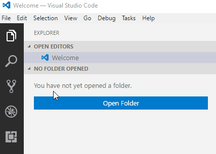

# Visual Studio Code Ruby Eklentisi Kurulumu

Visual Studio Code'un en güzel özelliklerinden birisi de çok sayıda
eklentiye sahip olmasıdır.

Eklenti terimi genel olarak bir yazılıma ekstra özellikler kazandıran
küçük boyutlu '*yama*'lardır.

Visual Studio Code'da Ruby kodları yazarken Ruby için özel geliştirilmiş
özelliklerini de kullanmak istiyorsak programın Ruby eklentisini kurmalıyız.

Eklenti kurma işlemi gayet basit olup aşağıda anlatılmıştır.

## Ruby Eklentisi Kurulumu

Visual Studio Code'u açtığınızda programın sol kenarında koyu renkli bir şerit,
göreceksiniz.

Bu şerit programda 5 sekme arasında geçiş yapmanızı sağlar.

Bu sekmeler şunlardır:

+ **Explorer** ( Keşfet, Dolaş, Gez... )

+ **Search** ( Ara )

+ **Source Control** ( Kaynak Kontrol / Sürüm Kontrol )

+ **Debug** ( Hata Ayıklama )

+ **Extensions** ( Eklentiler )

Yeni bir eklenti kurmak yada var olan eklentileri yönetmek için en alttaki 
iç içe geçmiş karelerden oluşan ve imleç (fare) üzerine getirildiğinde 
**Extensions** (Ctrl+Shift+X) yazısı beliren simgeye tıklıyoruz.

Açılan panelde en üstte eklentiler arasında arama yapmak için bir arama çubuğu
bulunuyor.

Hangi eklentiyi yüklemek istiyorsak bu arama çubuğuna ismini yazarak aramasını
bekliyoruz.

Aradığımız eklentiyi çıkan sonuçlar arasında bulduysak hemen sağ altındaki
yeşil **Install** düğmesine tıklayarak kurulumu gerçekleştiriyoruz.

Eklentimiz kısa süre içerisinde kurulacaktır.

Ancak kurduğumuz eklentinin aktifleşebilmesi için programın yeniden yüklenmesi
gerekmektedir. Bu sebeple eklenti yüklendikten sonra çıkan **Reload** yazan
mavi düğmeye tıklayarak (yada programı elle kapatıp açmak da bir seçenek)
programın yeniden başlamasını sağlarız.

Programımız yeniden başladığında eklentimiz aktifleşmiş olacaktır.

Eklenti kurulumunun görsel gösterimi aşağıda mevcuttur.

-----

Bu doküman [Serhat Celil İLERİ](http://serhatcileri.com) ( GitHub: [@ileri](https://github.com/ileri) ) tarafından oluşturulmuştur.